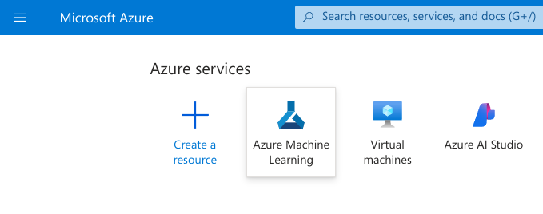
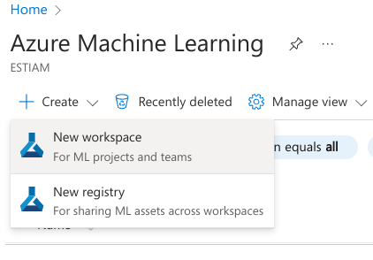
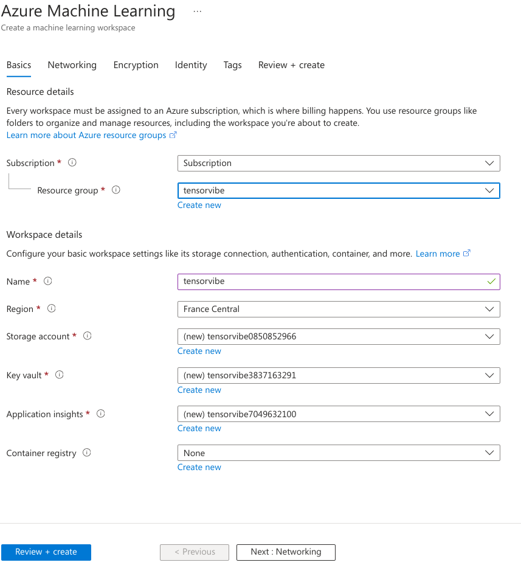
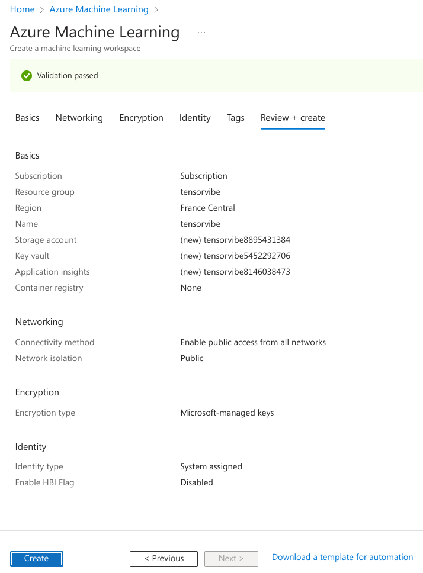
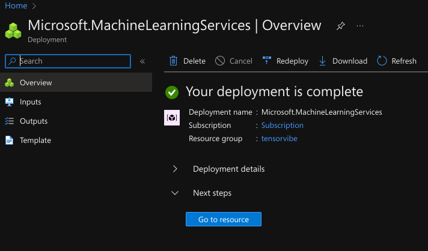
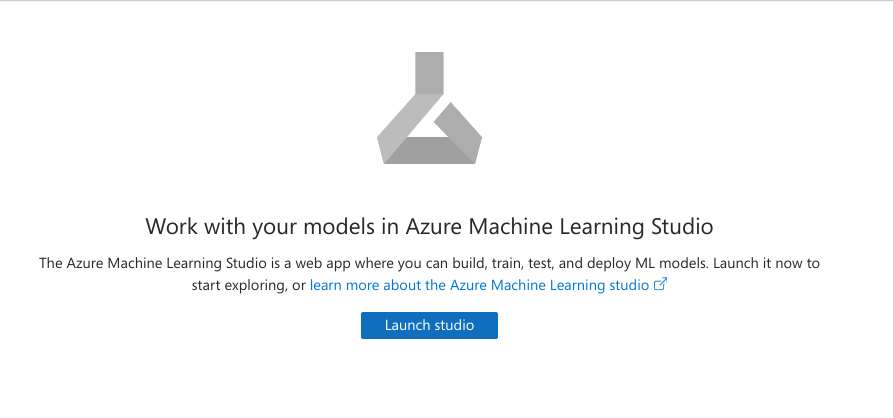
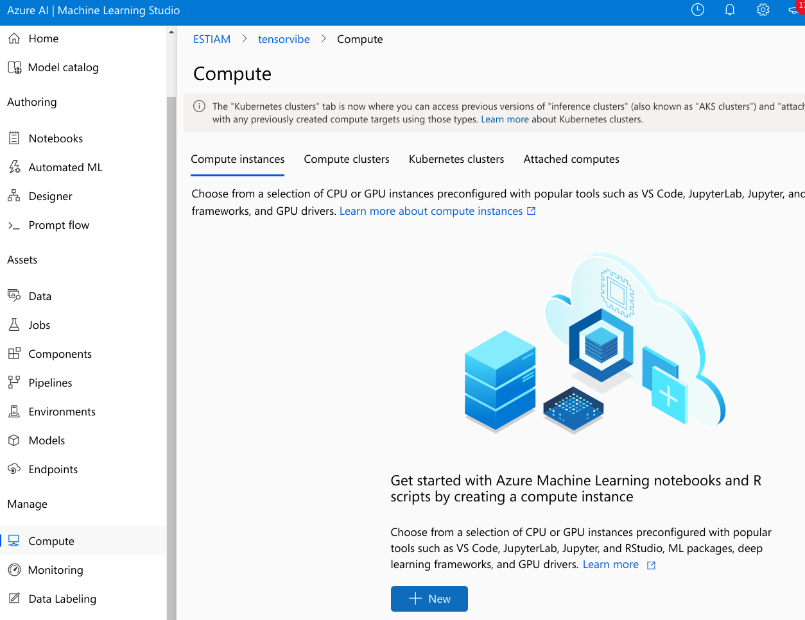
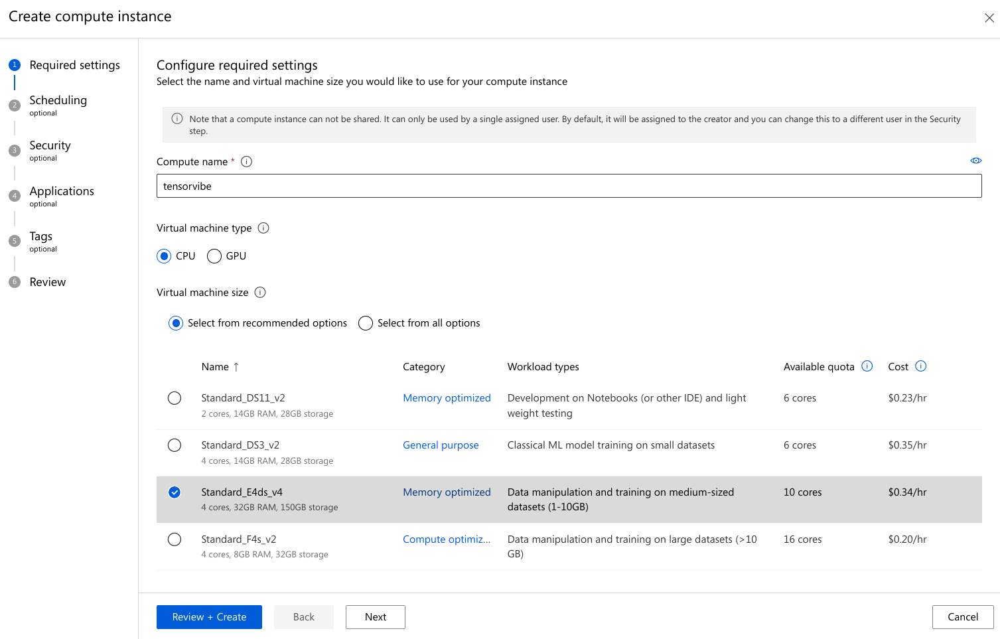
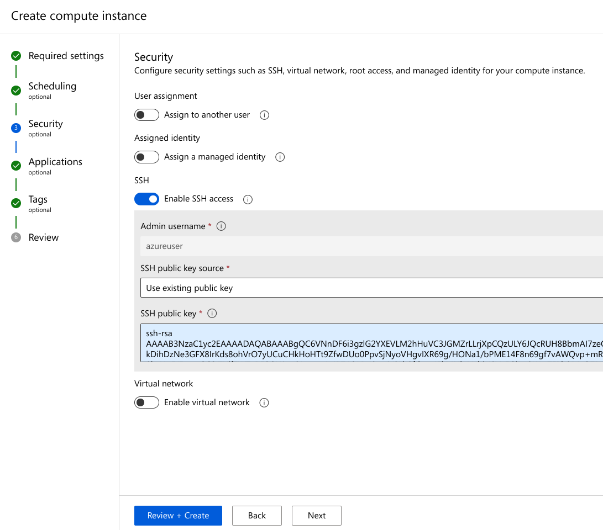

## Compute sur Microsoft Azure

> ℹ️ Ce projet nécessite un abonnement Microsoft Azure

> ⚠️ Afin de ne pas gaspiller des fonds, pensez à suprimer toutes ressources ou groupes inutilisés.

Pour créer un compute sur Azure, vous devez aller sur [https://portal.azure.com](https://portal.azure.com).

On commence par aller dans le service `Azure Machine Learning` pour créer une ressource. Si vous ne le trouvez pas allez dans la recherche et taper son nom. 

Vous vous retrouverez devant une liste vide (normalement). Supprimez tout espace de travail inutilisé.  Créez ensuite un nouvel espace de travail avec le bouton `[+ Create]` en haut à gauche. Vous serez redirigé vers un formulaire que vous compléterez comme suit :



Vous devez créer le groupe de ressource et vérifiez bien l'abonnement ainsi que la région. On clique sur `[Review + create]` puis on vérifie  avant de cliquer sur `[Create]`.

Après quelques minutes, vous devrez voir ceci : 



Cliquez `[Go to ressource]` puis `[Launch studio]`. Si vous ne le trouvez pas le studio est sur [https://ml.azure.com/](https://ml.azure.com/)

Une fois sur le portail machine learning, ouvrez votre espace de travail : 



Vous créer un compute pour exécuter votre code tensorflow. On a besoin de ceci afin de faire des calculs sur une machine plus puissante (Normalement avec une bonne carte graphique). Pour se faire allez dans l'onglet `Compute > [+ New]`.



Malheureusement l'abonnement par défaut d'Azure ne permet pas d'utiliser de compute GPU... On crée donc un compute CPU comme suit :



> ⚠️ Sélectionnez bien la machine `Standard_E4ds_v4` Afin d'avoir les meilleurs performances pour ce projet.

Cette fois-ci, on clique sur suivant jusqu'à l'écran `Security`. Vous devrez mettre en place un accès SSH. Activez l'option `( o) Enable SSH access` puis sélectionnez l'utilisation d'une clé publique existante. Entrez la clé dans le champ approprié 

## Client et clé SSH

SSH (Secure SHell) est un protocole réseau de connexion à une console distante. Par défaut, le client et serveur SSH sont désactivé sur Windows 11. Vous devez donc soit l'activer soit en innstaller un.

> On utilise souvent [Chocolatey](https://chocolatey.org/) pour installer des packages sur Windows. Pour l'installer, utilisez la combinaison de touche `[Win] + [X] > Powershell/Console Admin` puis collez ceci dans le terminal et appuyez sur `[Entrer]`.

``` powershell
Set-ExecutionPolicy Bypass -Scope Process -Force; [System.Net.ServicePointManager]::SecurityProtocol = [System.Net.ServicePointManager]::SecurityProtocol -bor 3072; iex ((New-Object System.Net.WebClient).DownloadString('https://community.chocolatey.org/install.ps1'))
```

> Sur d'autre OS, veuillez utiliser votre gestionnaire de package habituel.

## Méthode 1 : SSHFS + Sirikali

La méthode la plus simple, selon moi, est d'utilisez Chocolatey pour installer [sshfs](https://github.com/winfsp/sshfs-win) :

``` powershell
choco install sshfs -y
```

Puis installez [Sirikali](https://github.com/mhogomchungu/sirikali/releases/latest) manuellement

### Méthode 2 : Cyberduck et autres

Vous pouvez utiliser les alternatives suivantes :

* [Cyberduck](https://cyberduck.io/) `choco install cyberduck -y`. Pour se connecter ouvrez Cyberduck et suivez la [documentation](https://docs.cyberduck.io/protocols/sftp/#connecting) afin de génerer une clé privée et publique.
* [Bitvise](https://www.bitvise.com/ssh-client) `choco install bitvise-ssh-client -y`

### Méthode 3 : Openssh via Chocolatey

Utilisez la combinaison de touche `[Win] + [X] > Powershell/Console Admin` puis collez ceci dans le terminal et appuyez sur `[Enter]`.

``` powershell
Set-ExecutionPolicy Bypass -Scope Process -Force; [System.Net.ServicePointManager]::SecurityProtocol = [System.Net.ServicePointManager]::SecurityProtocol -bor 3072; iex ((New-Object System.Net.WebClient).DownloadString('https://community.chocolatey.org/install.ps1'))
choco install mls-software-openssh -y
```

### Méthode 4 : Tutorial Officiel Microsoft

Vous pouvez aussi suivre les tutoriaux Microsoft sur [l'installation d'openssh](https://learn.microsoft.com/fr-fr/windows-server/administration/openssh/openssh_install_firstuse?tabs=gui) et [la création de clé SSH](https://learn.microsoft.com/fr-fr/windows-server/administration/openssh/openssh_keymanagement)

## Python et Tensorflow

### Tensor-quoi ?

TensorFlow est une bibliothèque open-source développée par Google pour le calcul numérique et l'apprentissage automatique. Elle est largement utilisée pour construire, entraîner et déployer des modèles d'apprentissage automatique dans une variété de domaines, notamment la vision par ordinateur, le traitement du langage naturel, la reconnaissance vocale, etc.

#### Principes de Base

1. **Graphes de Calcul :** TensorFlow est basé sur un modèle de programmation par graphe de calcul. Les opérations mathématiques sont représentées sous forme de nœuds dans un graphe, et les données sont représentées sous forme de tenseurs (tableaux multidimensionnels) qui circulent entre les nœuds.

2. **Tenseurs :** Les tenseurs sont la structure de données fondamentale de TensorFlow. Ils peuvent être de différentes dimensions : des scalaires (0D), des vecteurs (1D), des matrices (2D) ou des tenseurs de rang supérieur.

3. **Sessions :** Pour exécuter des opérations dans un graphe TensorFlow, vous devez créer une session TensorFlow. Une session encapsule l'environnement dans lequel les opérations de calcul sont exécutées et les tenseurs sont évalués.

4. **Variables :** Les variables sont des tenseurs dont la valeur peut être modifiée pendant l'exécution du graphe. Elles sont souvent utilisées pour stocker les paramètres des modèles d'apprentissage automatique, comme les poids et les biais.

5. **Optimiseurs :** TensorFlow propose une gamme d'optimiseurs pour ajuster les paramètres des modèles pendant l'entraînement. Ces optimiseurs utilisent des algorithmes d'optimisation tels que la descente de gradient stochastique (SGD), Adam, RMSProp, etc.

#### Architecture de modèle

**Réseaux de Neurones Convolutifs (CNN) :**

Les CNN sont particulièrement efficaces pour la vision par ordinateur, mais ils peuvent également être utilisés pour le traitement du langage naturel. Ils sont composés de couches convolutionnelles qui extraient des caractéristiques des données en effectuant des opérations de convolution, suivies de couches de pooling pour réduire la dimensionnalité des caractéristiques extraites.

**Réseaux de Neurones Récurrents (RNN) :**

Les RNN sont adaptés au traitement de données séquentielles, comme le langage naturel. Ils ont une boucle récurrente qui leur permet de conserver une mémoire à court terme des séquences précédentes. Cela les rend efficaces pour les tâches de prédiction séquentielle, telles que la traduction automatique et la génération de texte.

**Réseaux de Neurones Récurrents à Longue Mémoire (LSTM) et Réseaux de Neurones Récurrents Gated Recurrent Unit (GRU) :**

Les LSTM et les GRU sont des variantes des RNN qui ont été conçues pour mieux gérer le problème du gradient qui disparaît ou explose pendant l'entraînement des RNN. Ils utilisent des mécanismes de porte pour contrôler le flux d'informations à travers les cellules récurrentes, ce qui leur permet de capturer des dépendances à plus long terme dans les séquences.

**Transformers :**

Les Transformers sont une architecture de modèle récente qui a révolutionné de nombreux domaines du traitement du langage naturel. Ils se composent de couches d'attention multi-têtes qui permettent au modèle de focaliser son attention sur différentes parties de la séquence en même temps, capturant ainsi des dépendances à longue distance de manière efficace.

### Vérifier l'installation de Python et Tensorflow

Créez le fichier Python `app.py` :

``` python
import sys
import tensorflow as tf

def main() -> int:
    print("Hello")
    return 0

if __name__ == '__main__':
    sys.exit(main())
```

> ℹ️ Vous pouvez utiliser la commande `nano` afin de créer des fichier texte en ligne de commande. On enregistre avec `[Ctrl] + [O] > [Enter]`.

Puis tappez la commande : `python app.py`

### Si bessoin : Installation via docker

Via SSH sur la machine virtuelle, exécutez les commandes suivantes :

``` shell
curl -fsSL https://get.docker.com -o get-docker.sh
sudo sh ./get-docker.sh
sudo usermod -aG docker $USER
sudo apt install docker-compose -y
docker -v
docker-compose -v
```

Créez le fichier `Dockerfile` suivant :

``` dockerfile
FROM tensorflow/tensorflow

COPY ${PWD} /app
WORKDIR /app

CMD python /app/app.py
```

Puis vous créez l'image docker avec la commande `docker build . -t testorflow` puis vous lancez le contenneur via `docker run tensorflow`. Vous pouvez voir les logs avec `docker logs tensorflow` et accéder à la console du conteneur avec `docker exec -it tensorflow bash`

## Git et Github

Pour votre projet, utilisez Git. Pour l'installer en local vous pouvez utiliser `choco install git -y` dans une console administrateur ou bien utilisez [VScode](https://code.visualstudio.com/) `choco install vscode`

Pour utiliser Git sur la machine virtuelle :

``` shell
sudo apt update
sudo apt upgrade -y
sudo apt install git -y
git --version
```
